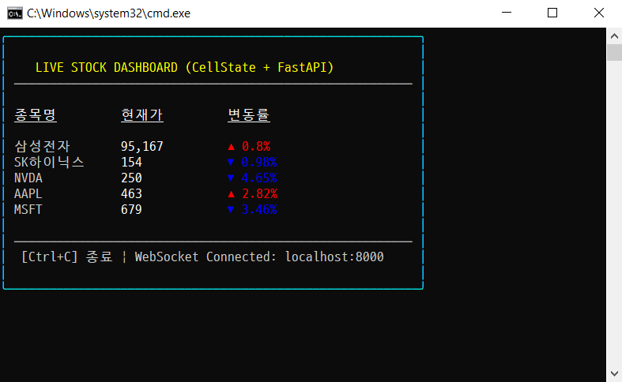

# CellState Demo

A demo app for cellstate TUI library.

## Install uv and node
% mise --version
% mise intall
% which uv
% which node

## Start Backend Server
```
% cd backend
% uv run main.py
```

## Start Frontend TUI Demo App
```
% cd frontend
% npm install
% npx tsx index.jsx
```

## Screenshot


# Reference
* https://github.com/nathan-cannon/cellstate